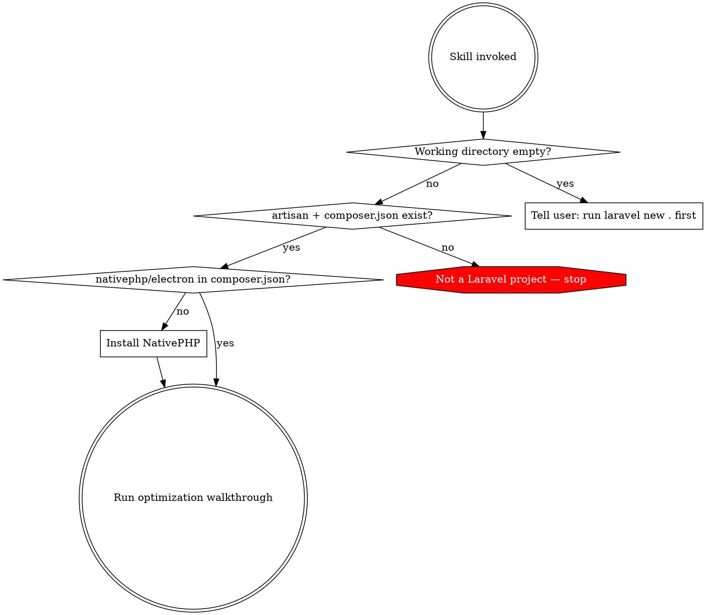
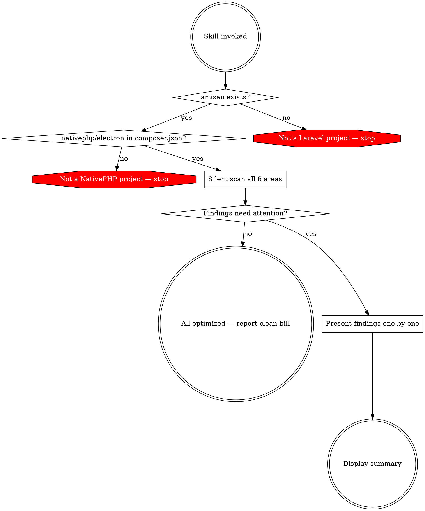

# PHP Native Skills Implementation Plan

> **For agentic workers:** REQUIRED SUB-SKILL: Use superpowers:subagent-driven-development (recommended) or superpowers:executing-plans to implement this plan task-by-task. Steps use checkbox (`- [ ]`) syntax for tracking.

**Goal:** Create two installable skills (`php-native-setup` and `php-native-audit`) that guide developers through optimizing Laravel + NativePHP desktop apps.

**Architecture:** Two standalone SKILL.md files following the agentskills.io specification. Each skill is a technique-type skill with a conversational decision flow. No supporting files needed — all logic is instructional, executed by the agent at runtime.

**Tech Stack:** Markdown skill files with YAML frontmatter, graphviz flowcharts for decision logic.

**Spec:** `docs/superpowers/specs/2026-03-27-php-native-skills-design.md`

---

### Task 1: Create directory structure

**Files:**
- Create: `skills/php-native-setup/SKILL.md` (placeholder)
- Create: `skills/php-native-audit/SKILL.md` (placeholder)

- [ ] **Step 1: Create skill directories**

```bash
mkdir -p skills/php-native-setup
mkdir -p skills/php-native-audit
```

- [ ] **Step 2: Commit scaffold**

```bash
git init
git add skills/
git commit -m "chore: scaffold php-native-skills directory structure"
```

---

### Task 2: Write baseline test for php-native-setup

Test what an agent does WITHOUT the skill when asked to set up a PHP Native project. This establishes what the skill needs to teach.

**Files:**
- None (observational test)

- [ ] **Step 1: Run baseline scenario**

Dispatch a subagent with this prompt (no skill loaded):

> "I have an empty directory and want to create a Laravel + NativePHP desktop app. Set it up for me with optimal settings for a desktop application."

Document:
- Did the agent detect the empty directory and suggest `laravel new`?
- Did it know about NativePHP-specific optimizations?
- Did it consider PHP config for desktop context?
- Did it think about XSRF, SQLite tuning, startup performance, CDN bundling, extensions?
- Did it ask the user or just apply changes blindly?

- [ ] **Step 2: Run second baseline — existing Laravel project**

Dispatch a subagent with this prompt:

> "I have a Laravel project and just installed NativePHP. What should I optimize for desktop use?"

Document:
- What optimizations did the agent suggest (if any)?
- Did it miss any of the 6 areas?
- Did it inspect machine specs or use hardcoded values?

- [ ] **Step 3: Document baseline gaps**

Write findings to `docs/superpowers/tests/baseline-setup.md`:
- What the agent got right
- What it missed
- What rationalizations it used for skipping things
- What the skill must explicitly teach

---

### Task 3: Write php-native-setup skill (GREEN)

**Files:**
- Create: `skills/php-native-setup/SKILL.md`

- [ ] **Step 1: Write the YAML frontmatter**

```yaml
---
name: php-native-setup
description: Use when starting a new Laravel + NativePHP desktop app or adding NativePHP to an existing Laravel project — guides through installation and desktop-optimized configuration
---
```

- [ ] **Step 2: Write the overview section**

Keep it concise — core principle in 1-2 sentences. State what the skill does: guides setup of Laravel + NativePHP with desktop-optimized settings through a conversational walkthrough.

- [ ] **Step 3: Write the entry point detection flowchart**



- [ ] **Step 4: Write detection instructions**

Provide exact commands the agent should run:
- `ls -A` to check if directory is empty
- Check for `artisan` file existence
- `grep "laravel/framework" composer.json` to verify Laravel
- `grep "nativephp/electron" composer.json` to verify NativePHP

- [ ] **Step 5: Write NativePHP installation section**

Exact commands:
```bash
composer require nativephp/electron
php artisan native:install
```
Instruct the agent to verify installation succeeded before continuing.

- [ ] **Step 6: Write optimization area (a) — PHP Configuration**

Instructions for the agent:
1. Detect machine specs: `sysctl -n hw.memsize` (macOS) or `cat /proc/meminfo` (Linux) for RAM, `nproc` or `sysctl -n hw.ncpu` for cores
2. Locate PHP config: check `php.ini` in NativePHP's config directory
3. Calculate appropriate values based on machine specs (provide formulas, e.g. memory_limit = RAM / 4, capped at 2G)
4. Present current vs proposed values to user with rationale
5. Apply only if user approves

Settings to cover: `memory_limit`, `max_execution_time`, `post_max_size`, `upload_max_filesize`

- [ ] **Step 7: Write optimization area (b) — XSRF Token**

Instructions for the agent:
1. Check if CSRF middleware is active (check `app/Http/Kernel.php` or `bootstrap/app.php` depending on Laravel version)
2. Explain to user: desktop app has no cross-site context, XSRF adds friction without security benefit
3. If user approves, remove or disable the middleware
4. Show the exact code change

- [ ] **Step 8: Write optimization area (c) — SQLite Tuning**

Instructions for the agent:
1. Check `config/database.php` for SQLite configuration
2. Propose adding/updating these pragmas:
   - `journal_mode: 'wal'`
   - `synchronous: 'normal'`
   - `cache_size: -20000` (20MB)
   - `busy_timeout: 5000`
3. Explain each setting and why it's safe for single-user desktop
4. Apply only with user consent

- [ ] **Step 9: Write optimization area (d) — Startup Performance**

Instructions for the agent:
1. Run `php artisan config:cache`, `route:cache`, `view:cache`
2. Check for Laravel Octane (`grep "laravel/octane" composer.json`)
3. Ask user what they want on the Electron loading page (app name, logo path, spinner, custom text)
4. Generate a static `loading.html` in the appropriate location
5. Wire it into NativePHP's Electron window configuration so it shows immediately on launch

- [ ] **Step 10: Write optimization area (e) — CDN Asset Bundling**

Instructions for the agent:
1. Scan for CDN references:
   - `grep -r "https://fonts.googleapis.com" resources/`
   - `grep -r "https://cdn." resources/`
   - `grep -r "https://unpkg.com" resources/`
   - `grep -rE "https?://[^\"']+\.(css|js|woff2?|ttf|eot)" resources/`
2. For each found reference, present to user: what it is, where it's used
3. If user approves bundling:
   - Download the asset locally
   - Place in `public/vendor/` or appropriate directory
   - Update the reference to point to the local file
4. Explain: desktop app may run offline, CDN dependencies will silently fail

- [ ] **Step 11: Write optimization area (f) — PHP Extensions**

Instructions for the agent:
1. Scan `composer.json` for `ext-*` requirements
2. Scan PHP files for extension-specific functions (e.g. `curl_init`, `simplexml_load_string`, `mb_strtolower`)
3. Cross-reference against NativePHP's PHP build config (check `nativephp.php` config or similar)
4. Check known essential extensions list: `sqlite3`, `pdo_sqlite`, `mbstring`, `openssl`, `fileinfo`, `json`, `tokenizer`, `xml`, `curl`, `dom`, `zip`
5. Flag any missing extensions with clear explanation of what needs them

- [ ] **Step 12: Write summary section**

Instruct the agent to display a final summary:
- What was configured (with values)
- What was skipped by user choice
- Any warnings or follow-up recommendations

- [ ] **Step 13: Verify token efficiency**

```bash
wc -w skills/php-native-setup/SKILL.md
```

Target: under 500 words for the main body. If over, compress — move details to inline comments or tighten language.

- [ ] **Step 14: Commit the setup skill**

```bash
git add skills/php-native-setup/SKILL.md
git commit -m "feat: add php-native-setup skill"
```

---

### Task 4: Test php-native-setup skill (GREEN verification)

- [ ] **Step 1: Re-run baseline scenarios WITH skill**

Dispatch subagents with the same prompts from Task 2, but now with the skill loaded. Verify:
- Does it detect directory state correctly?
- Does it walk through all 6 areas?
- Does it ask before each change?
- Does it inspect machine specs, not hardcode values?
- Does it generate a loading page?
- Does it scan for CDN dependencies?

- [ ] **Step 2: Document results**

Write to `docs/superpowers/tests/setup-green.md`:
- Which areas passed
- Which areas need skill refinement
- Any rationalizations the agent used to skip steps

- [ ] **Step 3: Fix any issues found (REFACTOR)**

Update `skills/php-native-setup/SKILL.md` to close loopholes. Add explicit counters for any rationalizations found.

- [ ] **Step 4: Commit fixes**

```bash
git add skills/php-native-setup/SKILL.md
git commit -m "refactor: close loopholes in php-native-setup skill"
```

---

### Task 5: Write baseline test for php-native-audit

- [ ] **Step 1: Run baseline scenario**

Dispatch a subagent with this prompt (no skill loaded):

> "Audit my Laravel + NativePHP project and tell me what settings aren't optimized for desktop use."

Document:
- Did the agent scan silently first or start making changes?
- Did it cover all 6 areas?
- Was the tone professional or casual?
- Did it skip areas already configured correctly?
- Did it ask before applying changes?

- [ ] **Step 2: Document baseline gaps**

Write findings to `docs/superpowers/tests/baseline-audit.md`

---

### Task 6: Write php-native-audit skill (GREEN)

**Files:**
- Create: `skills/php-native-audit/SKILL.md`

- [ ] **Step 1: Write the YAML frontmatter**

```yaml
---
name: php-native-audit
description: Use when reviewing an existing Laravel + NativePHP project for desktop optimization — scans configuration and presents findings for user decision
---
```

- [ ] **Step 2: Write the overview section**

Concise: audits an existing Laravel + NativePHP project against desktop-optimized defaults. Scans silently, then presents findings one-by-one with professional recommendations.

- [ ] **Step 3: Write the pre-check flowchart**



- [ ] **Step 4: Write the silent scan instructions**

For each of the 6 areas, provide the exact checks the agent should run (same detection logic as setup skill) but instruct it to collect all results before presenting anything.

- [ ] **Step 5: Write the presentation format**

Define the professional tone template for each finding:

```
**[Area Name]**
Currently: [current value/state]
Recommended: [proposed value/state]
Rationale: [one-sentence why]
Apply this change? [wait for user response]
```

Instruct agent to:
- Skip areas already optimally configured
- Present one finding at a time
- Wait for user decision before moving to next
- Never apply changes without explicit consent

- [ ] **Step 6: Write the summary format**

Three categories in the summary:
- Changes applied (with before/after values)
- Already configured correctly
- Skipped by user choice

- [ ] **Step 7: Verify token efficiency**

```bash
wc -w skills/php-native-audit/SKILL.md
```

Target: under 500 words.

- [ ] **Step 8: Commit the audit skill**

```bash
git add skills/php-native-audit/SKILL.md
git commit -m "feat: add php-native-audit skill"
```

---

### Task 7: Test php-native-audit skill (GREEN verification)

- [ ] **Step 1: Re-run baseline scenario WITH skill**

Same prompt as Task 5, with skill loaded. Verify:
- Does it scan silently first?
- Does it skip already-optimized areas?
- Is the tone professional, not casual?
- Does it wait for user approval on each finding?

- [ ] **Step 2: Document and fix**

Write results to `docs/superpowers/tests/audit-green.md`. Fix any issues in the skill.

- [ ] **Step 3: Commit fixes**

```bash
git add skills/php-native-audit/SKILL.md
git commit -m "refactor: close loopholes in php-native-audit skill"
```

---

### Task 8: Final review and cleanup

- [ ] **Step 1: Review both skills side-by-side**

Verify:
- CSO: descriptions start with "Use when...", no workflow summaries
- Names use only letters, numbers, hyphens
- Flowcharts follow graphviz conventions (diamond for decisions, box for actions, doublecircle for entry/exit)
- No placeholders, TBDs, or vague instructions
- All 6 optimization areas covered in both skills with consistent terminology

- [ ] **Step 2: Verify directory structure**

```
php-native-skills/
  skills/
    php-native-setup/
      SKILL.md
    php-native-audit/
      SKILL.md
  docs/
    superpowers/
      specs/
        2026-03-27-php-native-skills-design.md
      plans/
        2026-03-27-php-native-skills.md
      tests/
        baseline-setup.md
        setup-green.md
        baseline-audit.md
        audit-green.md
```

- [ ] **Step 3: Final commit**

```bash
git add -A
git commit -m "docs: add test results and finalize php-native-skills"
```
