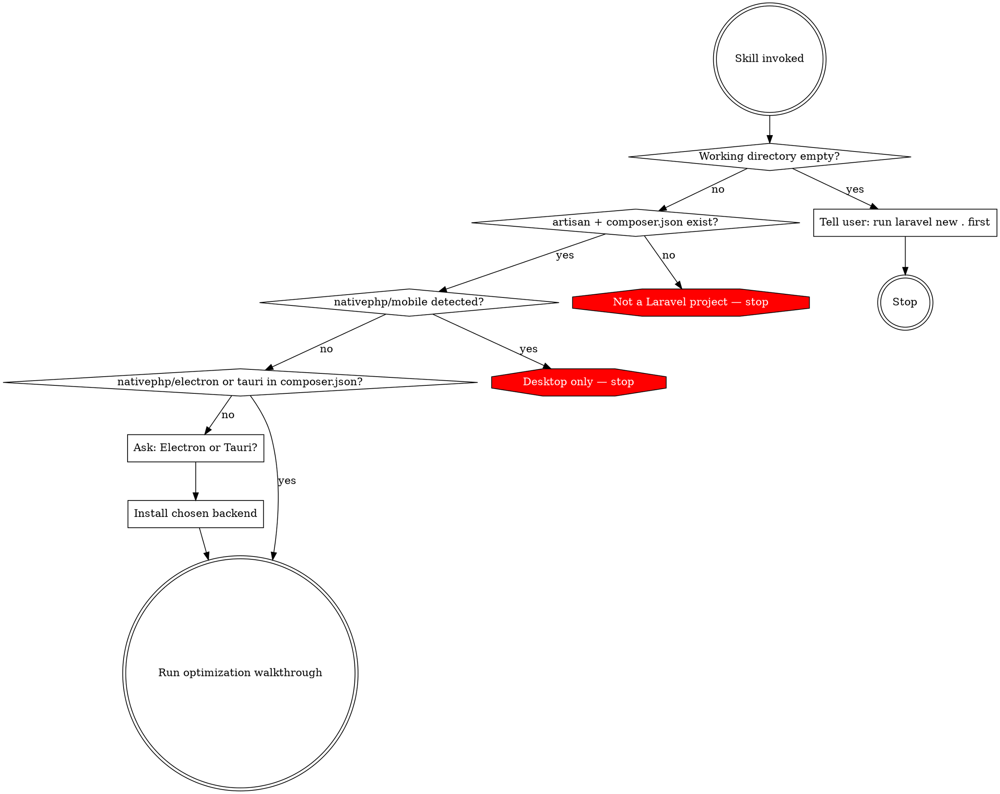

# PHP Native Setup

Set up a Laravel + NativePHP Desktop v2 app with optimized configuration. Present each optimization group one at a time. Never apply changes without consent.

## Entry Point Detection

Run these checks BEFORE doing anything else. Do not skip this.



### Detection commands

1. **Empty directory:** `ls -A` — if no output, tell user to run `laravel new .` and return. Do NOT use `composer create-project`.
2. **Laravel check:** `artisan` file exists AND `grep "laravel/framework" composer.json`. If either fails, stop.
3. **Mobile check:** `grep "nativephp/mobile" composer.json`. If found, stop: "This skill is for NativePHP Desktop only."
4. **NativePHP check:** `grep -E "nativephp/(electron|tauri)" composer.json`. If missing (even if `nativephp/laravel` is present), ask user: Electron or Tauri? Then install.
5. **Laravel version:** Check `laravel/framework` version in `composer.json` — needed for middleware location and SQLite pragma syntax.

## Installation

Ask the user: **Electron** (more mature) or **Tauri** (lighter, Rust-based)?

```bash
composer require nativephp/electron  # or nativephp/tauri
php artisan native:install
```

Verify installation succeeded before continuing.

## Optimization Walkthrough

Present each group ONE AT A TIME. Within each group, get per-item consent. Cover all nine groups in order — do not skip any.

### a) PHP Configuration

Check current `memory_limit` and `max_execution_time` values. Ask the user about their app's workload — if the app does heavy processing (image manipulation, large imports, data crunching), propose higher values via `ini_set()` in a service provider. If current values are already generous for the app's purpose, skip. Do not blindly propose fixed values.

### b) Middleware Cleanup

Check `laravel/framework` version in `composer.json` to determine middleware location (`app/Http/Kernel.php` for Laravel 10-11, `bootstrap/app.php` for Laravel 12+). Present each item with rationale, get per-item consent:

1. **VerifyCsrfToken** — no cross-site risk in desktop apps. Remove?
2. **PreventRequestsDuringMaintenance** — maintenance mode is meaningless for desktop. Remove?
3. **TrustProxies** — no reverse proxy in desktop apps. Remove?

### c) SQLite Tuning

Check `config/database.php`. Propose desktop-optimized pragmas. On Laravel 12+, use the native `pragmas` array. On Laravel 10-11, use individual keys in the SQLite connection config. Explain each briefly:

- `journal_mode=wal` — concurrent reads during writes
- `synchronous=normal` — safe for single-user, faster writes
- `cache_size=-20000` — 20MB in-memory page cache
- `busy_timeout=5000` — graceful wait instead of immediate lock errors
- `mmap_size=134217728` — 128MB memory-mapped I/O
- `temp_store=memory` — RAM for temporary storage

### d) Service Drivers

Check `config/queue.php`, `config/broadcasting.php`, `config/mail.php`. Desktop apps should not depend on Redis, Pusher, or external mail services. Propose per-item:

1. **Queue** — should be `sync` or `database`, not `redis`
2. **Broadcasting** — should be `log` or `null`, not `pusher`
3. **Mail** — should be `log` or `smtp` (local), not a cloud service

### e) Loading Page

NativePHP has no built-in desktop splash screen. Create a dedicated `/loading` route with `Window::open()->route('loading')` in `NativeAppServiceProvider`. The view should be a lightweight Blade template with inline CSS only (no Vite, no external assets) so it renders near-instantly. Ask the user what to display (app name, logo, spinner, custom content). Add JavaScript to redirect to the main app route when ready.

### f) CDN Asset Bundling

Scan `resources/` (Blade templates and CSS files) for external CDN references. Also check `tailwind.config.js` for font-family references that assume internet access. Present each found reference. Offer to download and bundle locally. After bundling fonts, verify `@font-face` declarations point to local files. Offline is non-negotiable for desktop apps.

### g) PHP Extensions

Scan `composer.json` for `ext-*` requirements. Scan PHP source for extension-specific functions. Cross-check against `config/nativephp.php` `php_extensions` list. Flag any required extension not in the config.

### h) Build Optimization

These belong in the build/packaging pipeline, NOT in the development workflow. Help wire them into the build script:

- **OPcache preloading** — create a preload script for Laravel core classes
- **Composer autoloader** — `composer dump-autoload --classmap-authoritative`
- **Laravel caches** — `config:cache`, `route:cache`, `view:cache`

Do not run these during development setup.

### i) Laravel Octane

Check if `laravel/octane` is installed (`grep "laravel/octane" composer.json`). If not present, explain the benefit: Octane keeps the Laravel application in memory between requests, eliminating bootstrap overhead. Ask if the user wants to add it.

## Summary

After completing all nine groups, display: what was configured, what was skipped, and any warnings.

## Red Flags

| Temptation | Why it's wrong |
|---|---|
| Skip entry point detection | May corrupt a non-Laravel project |
| Use `composer create-project` for empty directory | User should run `laravel new .` themselves |
| Apply changes without asking | User must consent to each optimization |
| Blindly propose PHP config values | Must be context-dependent based on app workload |
| Skip groups the user didn't mention | All nine groups must be presented |
| Run cache commands during dev setup | Caching belongs in the build pipeline |
