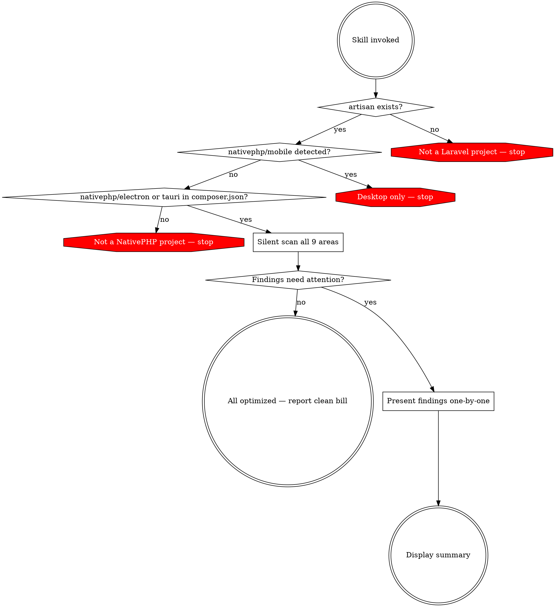

# PHP Native Audit

Audit a Laravel + NativePHP Desktop v2 app. Scan silently, then present only the findings that need attention — one group at a time, with user consent per change.

## Pre-checks

Stop immediately if any check fails. Do not proceed to scanning.



1. **Laravel:** `artisan` file exists. If not, stop: "This is not a Laravel project."
2. **Mobile check:** `grep "nativephp/mobile" composer.json`. If found, stop: "This skill is for NativePHP Desktop only."
3. **NativePHP:** `grep -E "nativephp/(electron|tauri)" composer.json`. If not found, stop: "NativePHP Desktop is not installed."
4. **Laravel version:** Check `laravel/framework` version in `composer.json` — needed for middleware location and SQLite pragma syntax.

## Silent Scan

Scan ALL nine areas before showing anything to the user. Collect findings into a list. Do not print progress or intermediate results.

### Areas

a) **PHP Configuration** — check `memory_limit` and `max_execution_time` values, consider the app's workload
b) **Middleware Cleanup** — check for active CSRF, `PreventRequestsDuringMaintenance`, `TrustProxies` middleware
c) **SQLite Tuning** — check WAL mode, synchronous, cache_size, busy_timeout, mmap_size, temp_store in `config/database.php`
d) **Service Drivers** — check queue, broadcasting, mail drivers for external service dependencies (redis, pusher, cloud mail)
e) **Loading Page** — check if a dedicated `/loading` route exists with a lightweight Blade view
f) **CDN Asset Bundling** — scan `resources/` (Blade, CSS) and `tailwind.config.js` for external CDN references including fonts
g) **PHP Extensions** — compare required extensions against `config/nativephp.php` `php_extensions` list
h) **Build Optimization** — check if build pipeline includes OPcache preloading, Composer classmap optimization, config/route/view caching
i) **Laravel Octane** — check if `laravel/octane` is installed

## Presenting Findings

After scanning, filter out areas already optimally configured. Present ONLY areas needing attention, ONE GROUP AT A TIME. Within each group, get per-item consent:

```
**[Group Name]**
Currently: [current value/state]
Recommended: [proposed value/state]
Rationale: [one sentence why]
Apply this change?
```

Wait for user decision before presenting the next finding. Never present multiple groups at once. Never offer batch approval.

### Tone

Professional and curated. State facts, propose changes, ask permission.

- YES: "Your queue driver is set to `redis`. Desktop apps should use `sync` or `database` — Redis won't be available on the user's machine. Switch to `sync`?"
- NO: "Hey! You should totally change that queue driver!"
- NO: "CRITICAL WARNING: YOUR APP IS BROKEN"

## Summary

Display AFTER all findings have been walked through — never before.

- **Applied:** changes made, with before/after values
- **Already optimal:** areas that needed no changes
- **Skipped:** changes the user declined

## Red Flags

| Temptation | Why it's wrong |
|---|---|
| Present all findings as a report | User can't make informed per-item decisions |
| Mention correctly-configured areas during walkthrough | Wastes user's time — save for summary |
| Offer "fix all" batch approval | Removes informed consent per change |
| Skip pre-checks | May not be a NativePHP Desktop project |
| Put summary at the top | Summary follows the walkthrough |
| Propose PHP config values without considering app workload | Values should be context-dependent |
