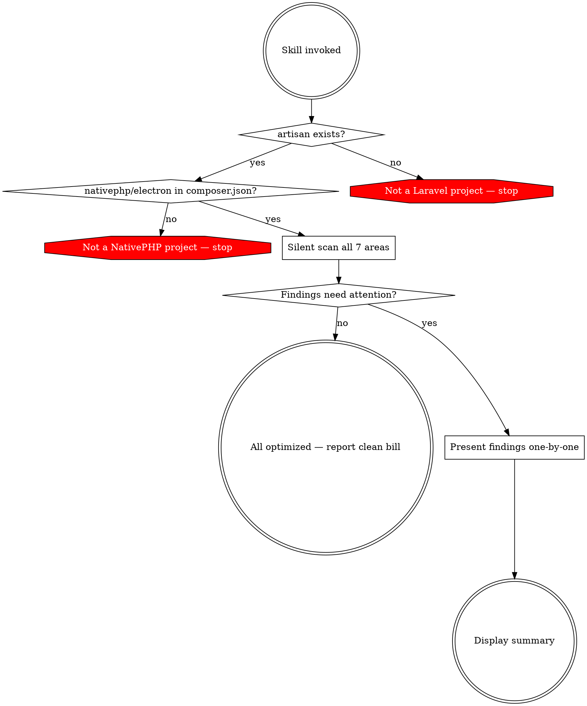

# PHP Native Audit

Audit a Laravel + NativePHP desktop app. Scan silently, then present only the findings that need attention — one at a time, with user consent per change.

## Pre-checks

Stop immediately if either check fails. Do not proceed to scanning.



1. **Laravel:** `artisan` file exists. If not, stop: "This is not a Laravel project."
2. **NativePHP:** `grep "nativephp/electron" composer.json`. If not found, stop: "NativePHP is not installed."

## Silent Scan

Scan ALL seven areas before showing anything to the user. Collect findings into a list. Do not print progress or intermediate results.

### Areas

a) **PHP Configuration** — compare `memory_limit`, `max_execution_time`, `post_max_size`, `upload_max_filesize` against machine-appropriate values
b) **XSRF Token** — check if CSRF middleware is still active
c) **SQLite Tuning** — check WAL mode, cache_size, synchronous, busy_timeout in `config/database.php`
d) **Startup Performance** — check if config/route/view caches exist
e) **Electron Loading Page** — check if a static loading page is configured
f) **CDN Asset Bundling** — scan templates, CSS, JS for external CDN references
g) **PHP Extensions** — compare required extensions against NativePHP bundled extensions

## Presenting Findings

After scanning, filter out areas already optimally configured. Present ONLY areas needing attention, ONE AT A TIME:

```
**[Area Name]**
Currently: [current value/state]
Recommended: [proposed value/state]
Rationale: [one sentence why]
Apply this change?
```

Wait for user decision before presenting the next finding. Never present multiple findings at once. Never offer batch approval.

### Tone

Professional and curated. State facts, propose changes, ask permission.

- YES: "Currently `memory_limit` is set to 128M. On this machine with 16GB RAM, a desktop app can safely use 1G. Apply this change?"
- NO: "Hey! You should totally bump that memory limit up!"
- NO: "CRITICAL WARNING: YOUR APP IS BROKEN"

## Summary

Display AFTER all findings have been walked through — never before.

- **Applied:** changes made, with before/after values
- **Already optimal:** areas that needed no changes
- **Skipped:** changes the user declined

## Red Flags

| Temptation | Why it's wrong |
|---|---|
| Present all findings as a report | User can't make informed per-item decisions |
| Mention correctly-configured areas during walkthrough | Wastes user's time — save for summary |
| Offer "fix all" batch approval | Removes informed consent per change |
| Skip pre-checks | May not be a NativePHP project |
| Put summary at the top | Summary follows the walkthrough |
