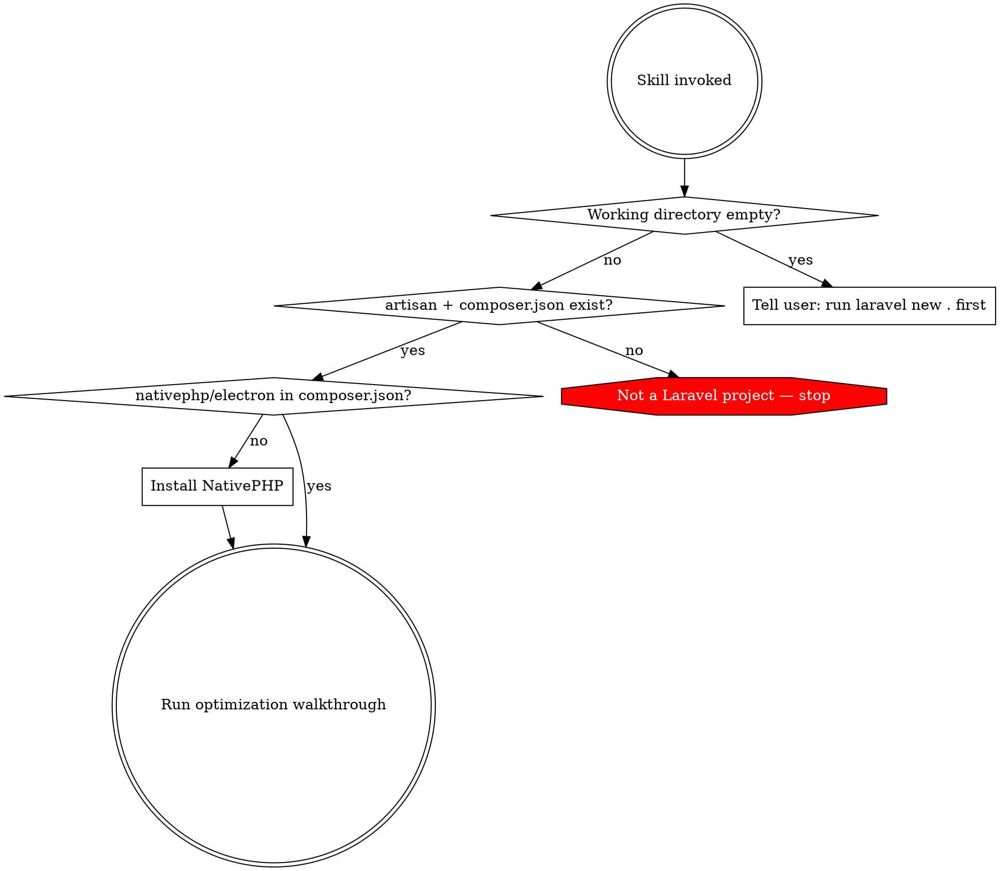

# PHP Native Setup

Set up a Laravel + NativePHP desktop app with optimized configuration. Present each optimization one at a time. Never apply changes without consent.

## Entry Point Detection

Run these checks BEFORE doing anything else. Do not skip this.



### Detection commands

1. **Empty directory:** `ls -A` -- if no output, tell user to run `laravel new .` and return. Do NOT use `composer create-project`.
2. **Laravel check:** `artisan` file exists AND `grep "laravel/framework" composer.json` matches. If either fails, stop.
3. **NativePHP check:** `grep "nativephp/electron" composer.json`. If missing, install next.

## Installation

If NativePHP is not installed:

```bash
composer require nativephp/electron
php artisan native:install
```

Verify installation succeeded before continuing.

## Optimization Walkthrough

Present each area ONE AT A TIME. Wait for user decision before proceeding. Cover all six in order -- do not skip any.

### a) PHP Configuration

Inspect machine specs: `sysctl -n hw.memsize` (macOS) or `cat /proc/meminfo` (Linux) for RAM; `sysctl -n hw.ncpu` or `nproc` for cores. Calculate: memory_limit = RAM/4 capped at 2G, max_execution_time = 300+, increase post_max_size and upload_max_filesize. Show current vs proposed with reasoning.

### b) XSRF Token

Check middleware in `app/Http/Kernel.php` or `bootstrap/app.php` (depends on Laravel version). Desktop apps have no cross-site risk. Offer to remove/disable CSRF middleware.

### c) SQLite Tuning

In `config/database.php`, propose: `journal_mode=wal`, `synchronous=normal`, `cache_size=-20000`, `busy_timeout=5000`. Explain each setting briefly.

### d) Startup Performance

Run `config:cache`, `route:cache`, `view:cache`. Check for Octane. Ask user what to display on the loading page (app name, logo, spinner). Generate `loading.html` for Electron and wire it into the NativePHP window configuration.

### e) CDN Asset Bundling

Scan `resources/` for CDN URLs: `fonts.googleapis.com`, `cdn.*`, `unpkg.com`, `cdnjs.cloudflare.com`, and any `.css`/`.js`/`.woff2`/`.ttf`/`.eot` URLs. Present each reference found. Download and bundle locally if user approves. Desktop apps may run offline.

### f) PHP Extensions

Scan `composer.json` for `ext-*` requirements. Scan PHP files for extension-specific functions. Cross-check against NativePHP build config. Verify essentials: sqlite3, pdo_sqlite, mbstring, openssl, fileinfo, json, tokenizer, xml, curl, dom, zip. Flag anything missing.

## Summary

After completing all six areas, display: what was configured, what was skipped, and any warnings.
