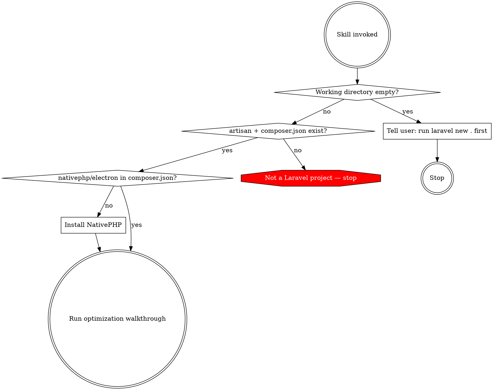

# PHP Native Setup

Set up a Laravel + NativePHP desktop app with optimized configuration. Present each optimization one at a time. Never apply changes without consent.

## Entry Point Detection

Run these checks BEFORE doing anything else. Do not skip this.



### Detection commands

1. **Empty directory:** `ls -A` -- if no output, tell user to run `laravel new .` and return. Do NOT use `composer create-project`.
2. **Laravel check:** `artisan` file exists AND `grep "laravel/framework" composer.json` matches. If either fails, stop.
3. **NativePHP check:** `grep "nativephp/electron" composer.json`. If missing, install next.

## Installation

If NativePHP is not installed:

```bash
composer require nativephp/electron
php artisan native:install
```

Verify installation succeeded before continuing.

## Optimization Walkthrough

Present each area ONE AT A TIME. Wait for user decision before proceeding. Cover all seven in order -- do not skip any.

### a) PHP Configuration

Inspect machine specs (RAM, CPU cores). Propose desktop-appropriate values for `memory_limit`, `max_execution_time`, `post_max_size`, `upload_max_filesize`. Show current value, proposed value, and reasoning. Wait for user decision.

### b) XSRF Token

Check if CSRF middleware is active. Explain why desktop apps have no cross-site risk. Offer to remove/disable it. Wait for user decision.

### c) SQLite Tuning

Check `config/database.php`. Propose desktop-optimized pragmas (WAL mode, relaxed synchronous, larger cache, busy timeout). Explain each briefly. Wait for user decision.

### d) Startup Performance

Propose running `config:cache`, `route:cache`, `view:cache`. Check for Laravel Octane. Present and wait for user decision.

### e) Electron Loading Page

This is a separate decision from caching. The Electron window should open immediately with a static page instead of waiting for PHP to boot. Ask the user what to display (app name, logo, spinner, custom content). Generate `loading.html` and wire it into the NativePHP window configuration. Wait for user decision.

### f) CDN Asset Bundling

Scan templates and assets for external CDN references (fonts, CSS, JS, icons). Present each found reference. Offer to download and bundle locally — desktop apps may run without internet. Wait for user decision.

### g) PHP Extensions

Scan `composer.json` and PHP source for required extensions. Cross-check against NativePHP build config and essential extension list. Flag anything missing. Wait for user decision.

## Summary

After completing all seven areas, display: what was configured, what was skipped, and any warnings.

## Red Flags

| Temptation | Why it's wrong |
|---|---|
| Skip entry point detection | May corrupt a non-Laravel project |
| Use `composer create-project` for empty directory | User should run `laravel new .` themselves |
| Apply changes without asking | User must consent to each optimization |
| Hardcode PHP config values | Values must be calculated from machine specs |
| Skip areas the user didn't mention | All seven areas must be presented |
